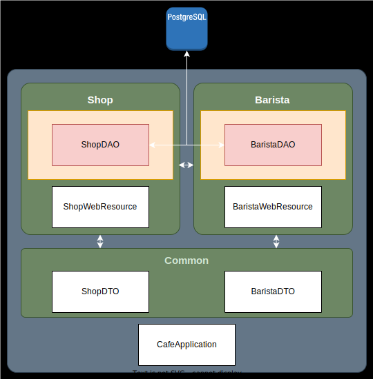
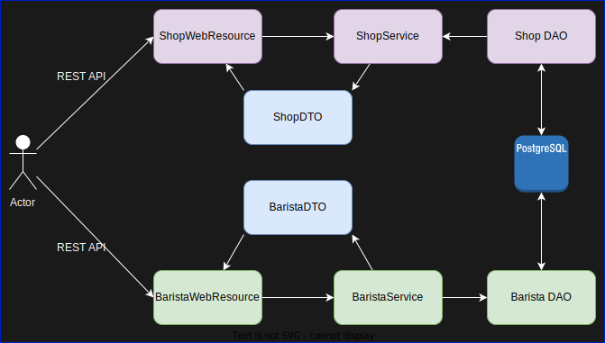

# Cafe Demo Application - Spring Modulith 

This is a demo application to demonstrate the Spring Modulith concept. 

## Modules

### Overall diagram



This application has three modules:
1. Common Module - This is common module which contains common classes.
2. Shop Module - This module contains shop related classes.
3. Barista Module - This module contains barista related classes.

### Data Flow



## How to run

### Prerequisites

1. Java 21
2. Gradle 8.10+
3. Docker/Podman

### Steps

1. Clone the repository
2. Run the application using the following command:
```shell
./gradlew clean bootRun
```


