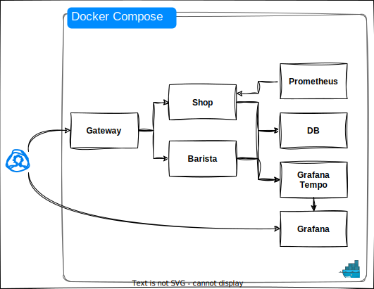
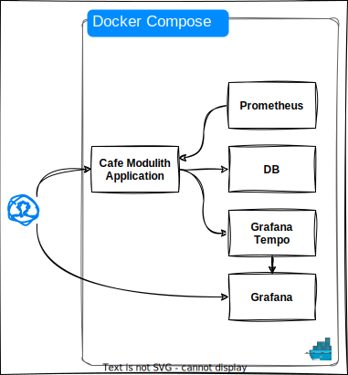

This article shares my views on Spring Modulith and its uses in software development and deployment architecture.

## What is Spring Modulith?

Spring Modulith is a software architecture pattern that combines the best of monoliths and microservices. 
It is a modular monolith that allows developers to build and deploy applications as a set of logical modules. 
Each module is a self-contained well-defined domain functionality that can be developed, tested, and deployed 
independently.

Modulith is a balancing act between microservices architecture and moinolith architecture. It allows developer s to 
create a single deployable artifact while maintaining the independence of services provided by microservices. This is 
helpful in reducing architecture complexity and improving the maintainability of the application. Such 
architecture is helpful at scenarios where complexity of microservices (distributed tracing, bulkhead, distributed transactions, distributed caching) 
is not required but still the application is large enough to be broken down into multiple modules.

# Scenario discussed in this article

An application is envisioned as a small application to manage various locations of a cafe and employees assigned to each location.
A microservice based solution to manage such an application is overkill. However, the application is large enough to be broken down into multiple modules.

# Application Architecture - Microservices vs Modulith

A simple diagram of the application is shown below:

Following are assumptions taken for this diagram:
- All endpoints are managed using gateway
- Gateway is responsible for routing requests to respective services
- Database per service pattern is followed
- Each service is responsible for its own data
- Services will scale based on load
- Common telemetry and logging is implemented for all services

A typical local development solution assuming microservices architecture could be:

Due to use of microservices architecture, we see two modules (services) have their own pods. This necessitates the need
for complex configuration on load balancers and service discovery. This is true for both AWS ECS, AWS ALB or locally for 
kubernetes configurations. This also increases the complexity of the application observability configurations for various 
tooling.

With implementation of spring modulith, the complexity of the application is reduced. The application is still broken down
to modules but the modules are deployed as a single artifact. This reduces the complexity of the application observability,
deployment cost and overall cost of maintainability.

A typical local development solution assuming spring modulith architecture could be:

With Modulith, final deployment will also be simplified. The application will be deployed as a single artifact. This will
reduce minimum required components as shown below:

Here, I have remove distributed logging done using ElasticSearch and Kibana. This is because the application is small enough 
to use direct console logging. However, if the application grows, the logging can be easily replaced with ElasticSearch and Kibana.

